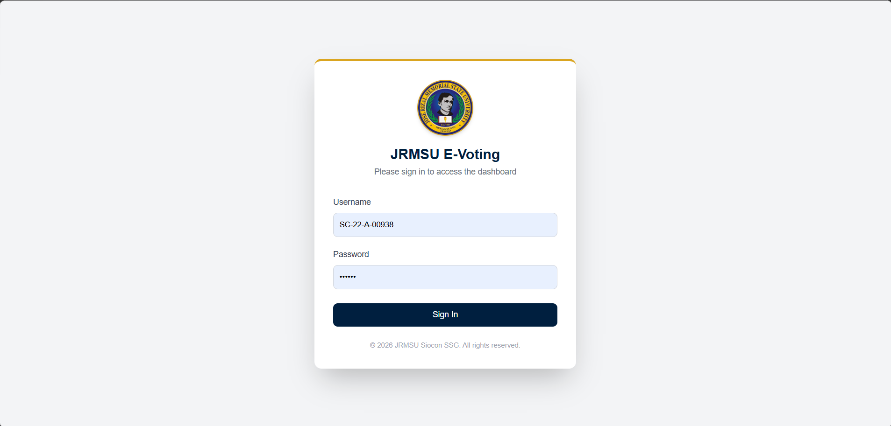
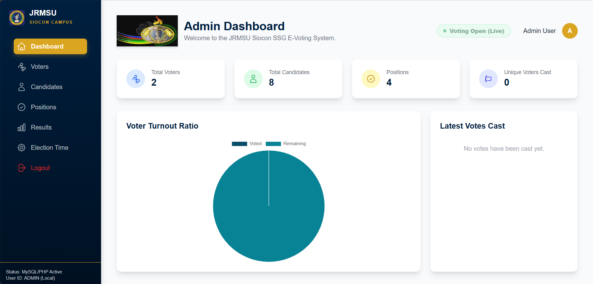
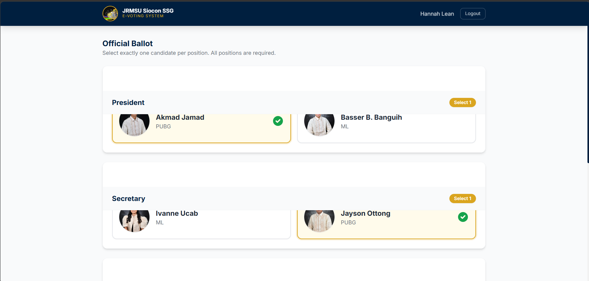
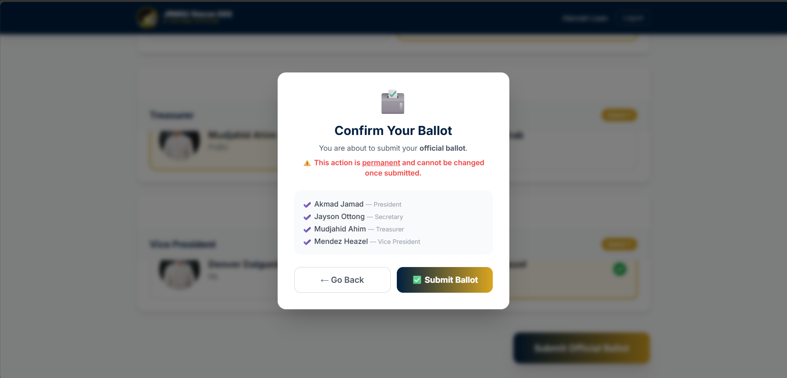
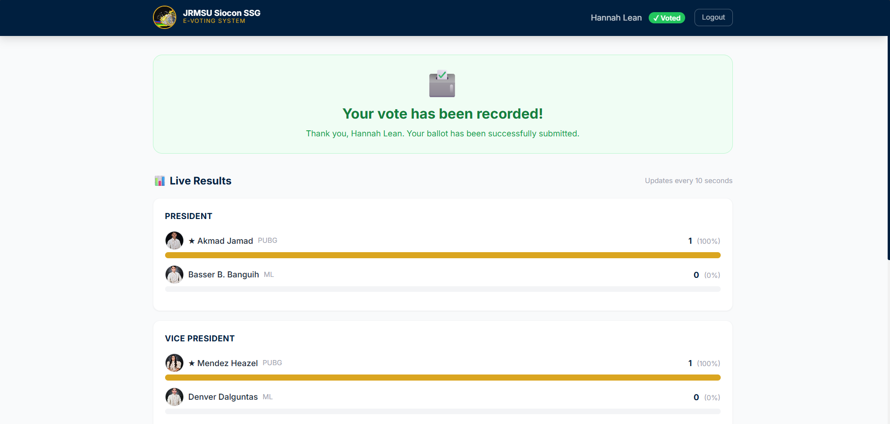
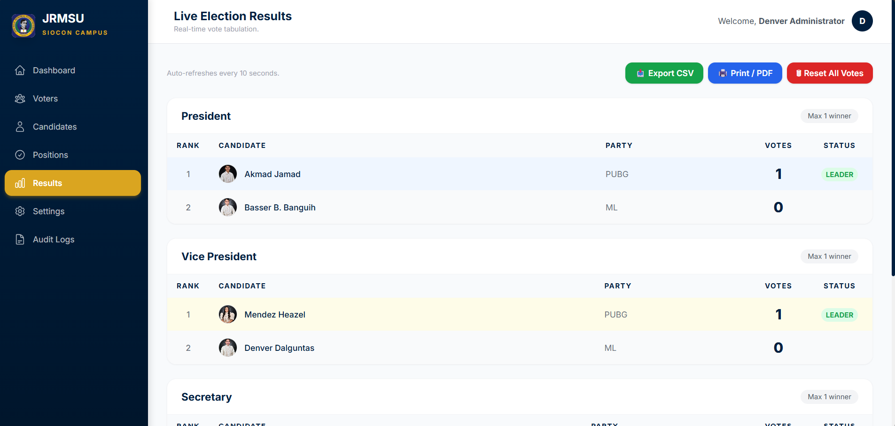
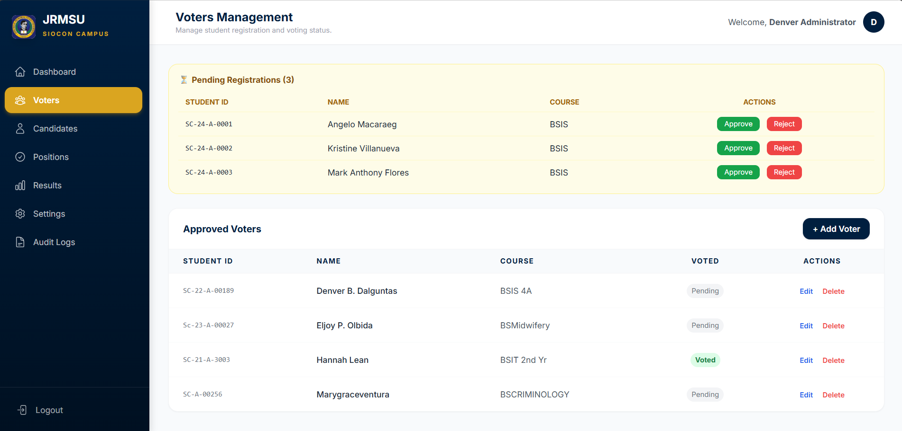

# JRMSU E-Voting System

🔗 **Live Demo:** [jrmsu-ssg-evoting.onrender.com](https://jrmsu-ssg-evoting.onrender.com)

A web-based electronic voting system built for Jose Rizal Memorial State University (JRMSU) Siocon Campus SSG Elections. Built with Laravel 12, it handles the full election workflow — from voter registration and admin approval, to ballot casting and live results tabulation.

---

## Screenshots

| Voter Login (Student ID step) | Admin Login |
|---|---|
|  |  |

| Admin Dashboard | Official Ballot |
|---|---|
|  |  |

| Ballot Confirmation | Live Results (Voter View) |
|---|---|
|  |  |

| Admin Results Page | Voters Management |
|---|---|
|  |  |

---

## Features

### Admin Panel
- Secure admin login (rate-limited to 5 attempts per minute)
- Voter registration management — view pending registrations, approve or reject per voter
- Manually add voters directly from the admin panel
- Manage election positions (with configurable max winners per position)
- Manage candidates with photo upload support
- Configure election schedule — set exact start and end datetime
- Live election results with auto-refresh every 10 seconds
- Export results as CSV or printable PDF
- Reset all votes (with audit trail)
- Full audit log — every action is recorded with actor, timestamp, and IP

### Voter Portal
- Self-registration with Student ID, name, and course — no password required at signup
- Admin approval required before a voter can log in
- First-time login sets the voter's password (no pre-assigned credentials needed)
- Time-gated ballot — voting only opens within the configured election window
- One-person, one-vote — double-vote attempts are blocked and logged
- Ballot confirmation modal before final submission (irreversible)
- Live results visible immediately after voting, updates every 10 seconds

---

## Tech Stack

| Layer | Technology |
|---|---|
| Framework | Laravel 12 (PHP 8.2+) |
| Database | MySQL |
| Frontend | Blade templates, Vite |
| Auth | Dual session guards — Admin + Voter (separate login flows) |
| Deployment | Render (web app) + Railway (MySQL database) |

---

## Project Structure

```
app/
├── Http/
│   ├── Controllers/
│   │   ├── Admin/          # AuthController, DashboardController, VoterController,
│   │   │                   # CandidateController, PositionController, ResultController,
│   │   │                   # SettingController, AuditLogController
│   │   └── Voter/          # AuthController (login, register, first-time password),
│   │                       # VoterDashboardController (ballot, vote submit, live results)
│   ├── Middleware/         # AuthenticateAdmin, AuthenticateVoter
│   └── Traits/
│       └── LogsActivity.php   # Shared audit logging used across all controllers
├── Models/                 # Admin, Voter, Candidate, Position, Vote, Setting, AuditLog
database/
├── migrations/             # voters, admins, positions, candidates, votes, settings, audit_logs
└── seeders/
    └── AdminSeeder.php     # Seeds the default admin account on first deploy
routes/
└── web.php                 # /admin/* and /voter/* route groups, root redirects to voter login
```

---

## Database Schema

- **admins** — username, bcrypt password, name
- **voters** — student_id, name, course, password (nullable until first login), `has_voted`, `is_approved`
- **positions** — name, `max_votes` (supports multi-winner positions)
- **candidates** — name, party_list, position_id (FK), image path
- **votes** — voter_id, position_id, candidate_id — unique constraint prevents duplicate votes at DB level
- **settings** — key-value store for `start_time` and `end_time`
- **audit_logs** — actor type, actor ID, action, IP address, JSON metadata, timestamp

---

## Voter Login Flow

The voter login is designed so students don't need a pre-assigned password:

1. Student registers with Student ID, name, and course — no password at this step
2. Admin reviews and approves (or rejects) the registration
3. On first login, the voter enters their Student ID and sets their own password
4. Subsequent logins use Student ID + that password

---

## Setup (Local)

**Requirements:** PHP 8.2+, Composer, Node.js, MySQL

```bash
# 1. Clone the repo
git clone <repo-url>
cd jrmsu-evoting

# 2. Install dependencies
composer install
npm install

# 3. Configure environment
cp .env.example .env
php artisan key:generate

# 4. Set DB credentials in .env
DB_HOST=127.0.0.1
DB_DATABASE=jrmsu_evoting
DB_USERNAME=root
DB_PASSWORD=

# 5. Run migrations and seed admin
php artisan migrate
php artisan db:seed

# 6. Build assets and serve
npm run build
php artisan serve
```

Default admin credentials are defined in `AdminSeeder.php` — change before going live.

---

## Deployment (Render + Railway)

```
APP_ENV=production
APP_KEY=<generated>
APP_URL=https://your-app.onrender.com

DB_HOST=<railway-internal-host>   # use internal host, not public TCP proxy
DB_PORT=3306
DB_DATABASE=railway
DB_USERNAME=root
DB_PASSWORD=<railway-password>
```

> Use Railway's **internal hostname** when deploying on Render — the public TCP proxy causes connection issues.

---

## Security

- All passwords hashed with bcrypt
- Login routes rate-limited (5 attempts/min for both admin and voter)
- Vote submission server-side validates that each candidate belongs to the correct position
- Overvote detection — aborts ballot if selected candidates exceed `max_votes` for any position
- Database-level unique constraint on `(voter_id, position_id, candidate_id)` as a hard safeguard
- Every sensitive action is recorded in the audit log (logins, votes, resets, approvals)

---

## About This Project

Built independently as a personal project — for practicing Laravel and as a portfolio piece for freelance work. The goal was to go beyond a basic CRUD app: real dual-guard authentication, server-side vote integrity checks, audit logging, and actual deployment on live infrastructure.

---

## Author

**Julfahad** — Freelance Web Developer | Laravel / PHP
